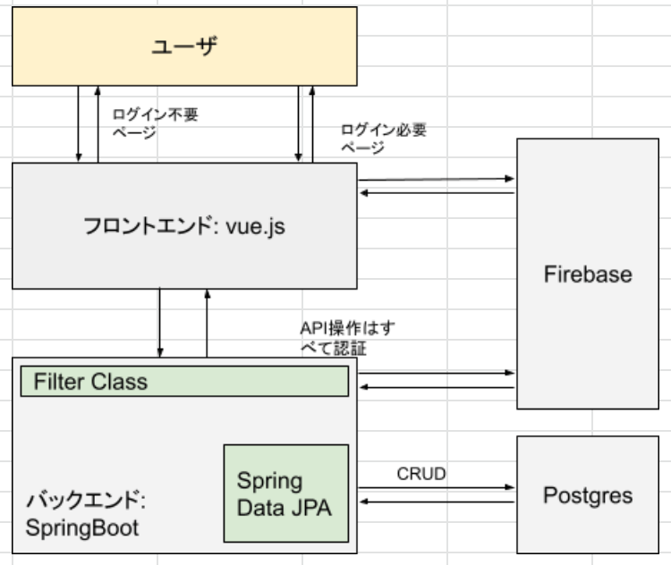
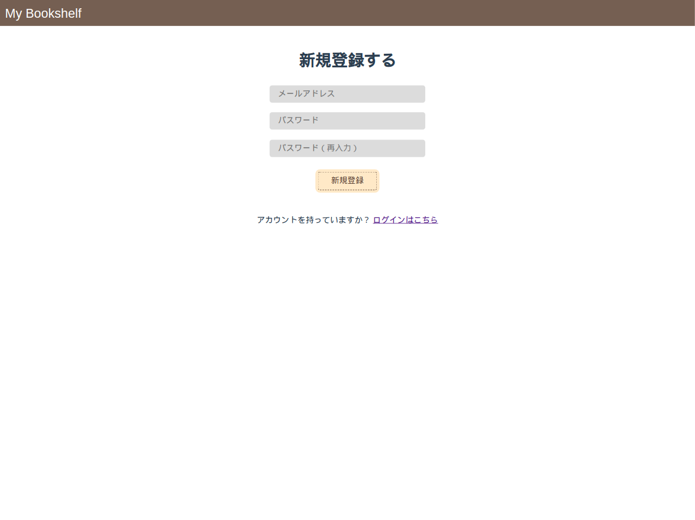
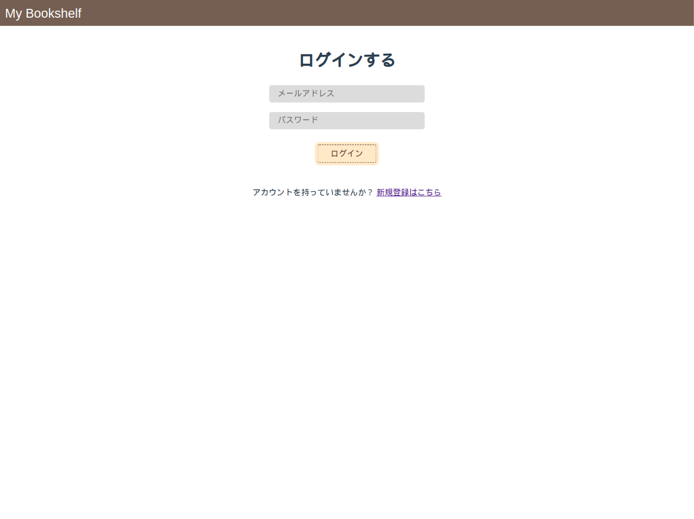
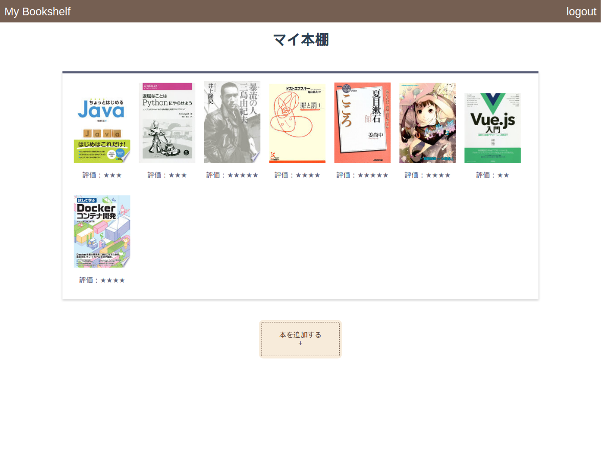
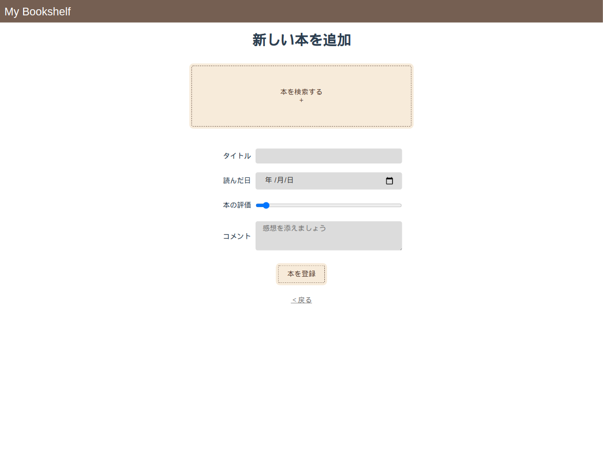
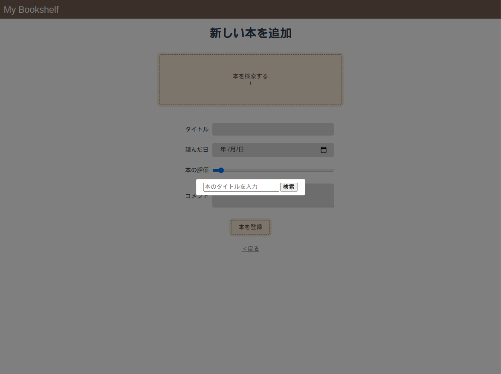
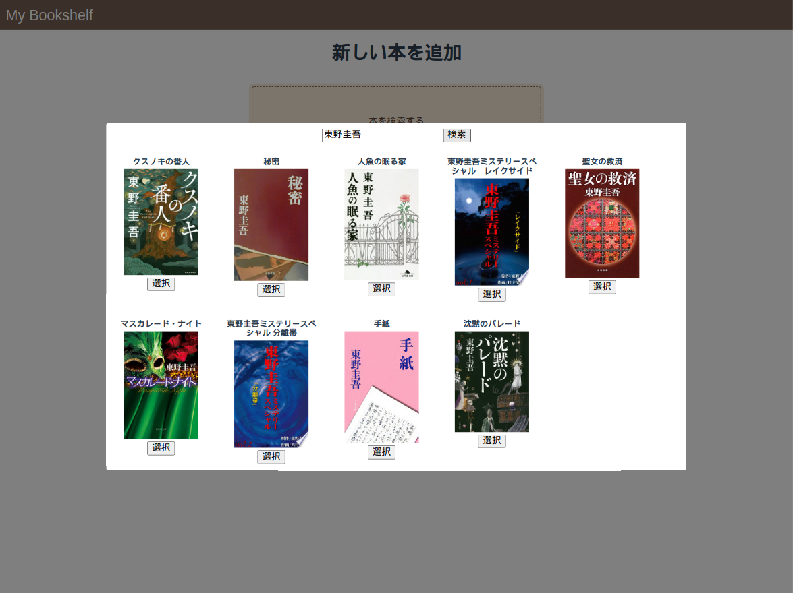
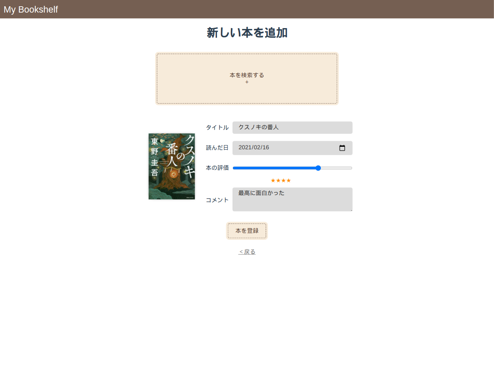

# my-bookshelf-docker-all

## リポジトリ概要
my-bookshelfシリーズのfront, back, dbをすべてDocker化したリポジトリ。  
ローカル開発はここで行う。

## アプリ概要
読んだ本の感想などを保管できるアプリです。  
読んだ本を管理できたらいいな × いろんな技術をまとめて使いたいなと思い、自作しました。  
<span style="color: red; ">詳細については、このREADMEの一番下にアプリ内の画像を用意しています。</span>

■ 1st release(2021/2/15)  
　・ログイン機能  
　・読了日、評価、感想を添えられる  

### ToDo
- [ ]Buildで毎回Maven依存関係をイチからDLするのを何とかする。。
- [ ]ログ
- [ ]本推薦機能追加
- [ ]本IDや本ジャンルなどを追加
- [ ]ユーザーネーム追加
- [ ]SNSログイン追加
- [ ]その他諸々。

## 使用技術
#### フロントエンド
- Vue.js
- Firebase
#### バックエンド
- Spring Boot
- PostgreSQL
#### インフラ（希望）
①ECS, Code Pipeline, Aurora  
②S3やCloudFrontをうまく使えるなら使う…？

## ローカル環境構築手順
#### 1. docker, docker-composeのインストール
```
docker version 
docker-compose version
```
出力がなければインストール  

参考：[Dockerのインストール](https://docs.docker.com/get-docker/)  
参考：[Docker Composeのインストール](https://matsuand.github.io/docs.docker.jp.onthefly/compose/install/)

#### 2. Firebaseプロジェクトの作成
1. Firebaseでプロジェクトを作成し、"firebaseConfig"の値をすべてメモする。  
1. frontendディレクトリに".env.local"という名前のファイルを作成する。  
1. ".env"ファイルのキーを".env.local"にコピーし、先ほどメモしていたConfigの値を入れていく。  
1. firebaseプロジェクトのAuthenticationで、メールとパスワードによる認証をONにしておく。
  
参考：[Qiita: Firebaseプロジェクト作成方法](https://qiita.com/yoshi0518/items/25af102845ba05545f98)

#### 3. 起動
ビルド
```
docker-compose build
```

起動
```
docker-compose up -d
```
停止
```
docker-compose stop
```
イメージとコンテナ削除
```
docker image prune
docker container prune
```

## アーキテクチャ


## アプリ画像
デプロイがまだできないので、こちらの画像でご紹介します。
  
  
  
  
##### 本を追加  
  
  
  
  
##### 詳細画面  
  
