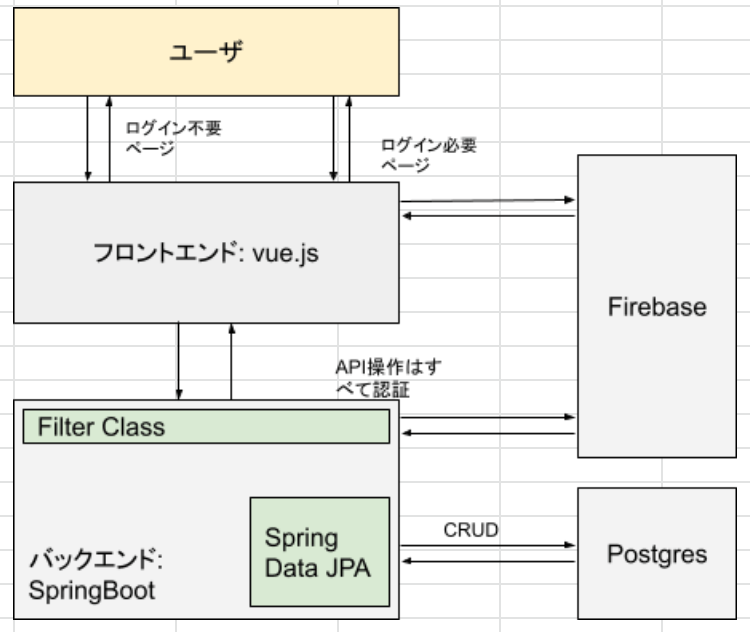
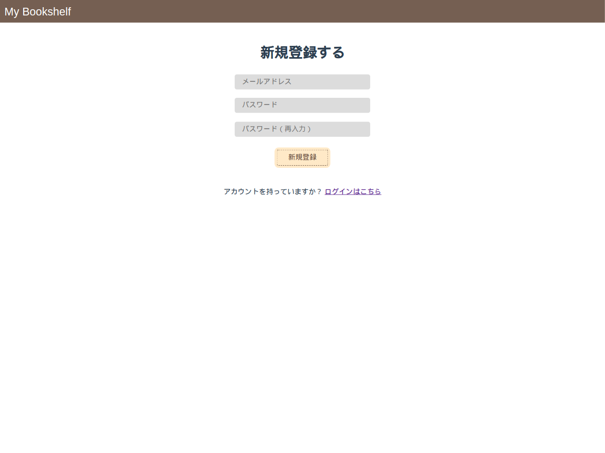
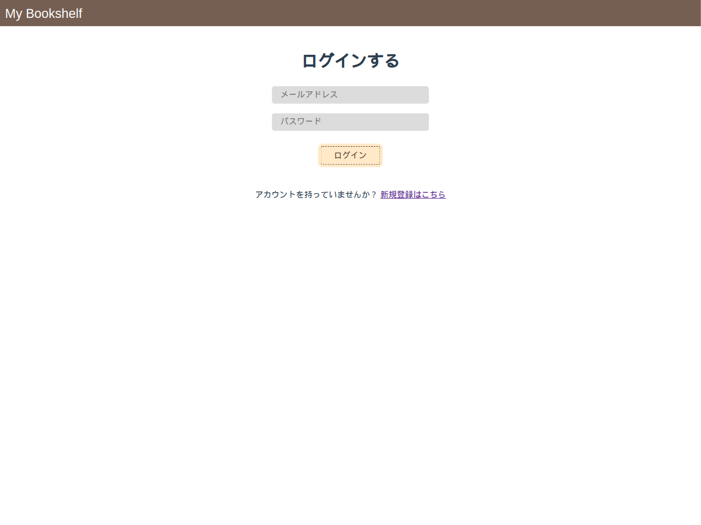
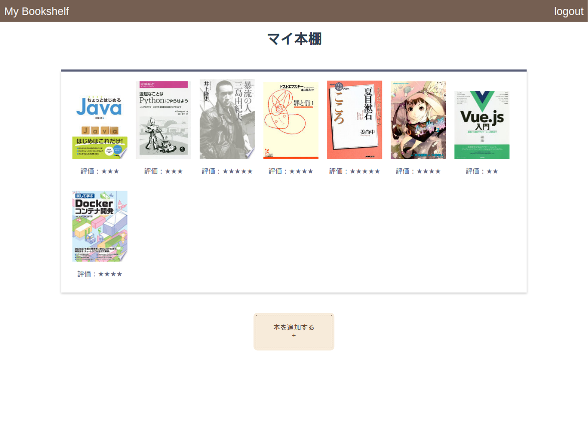
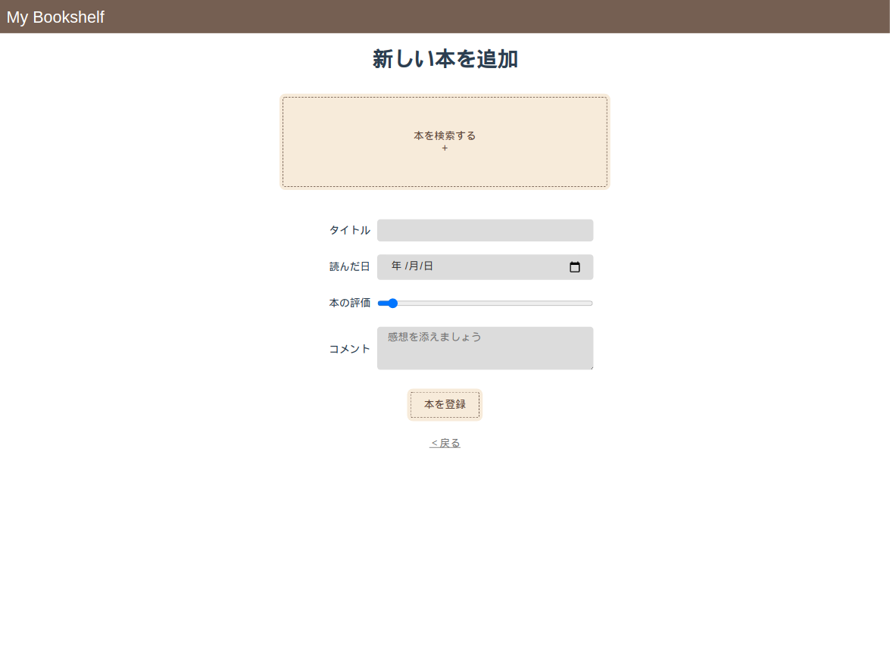
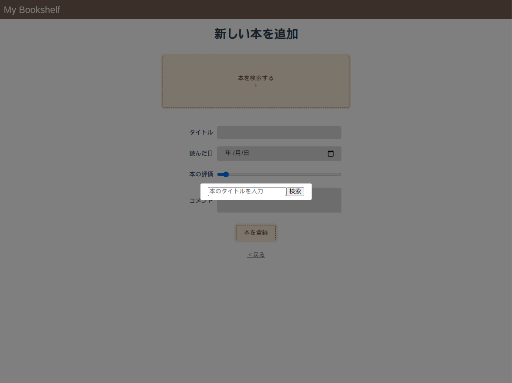
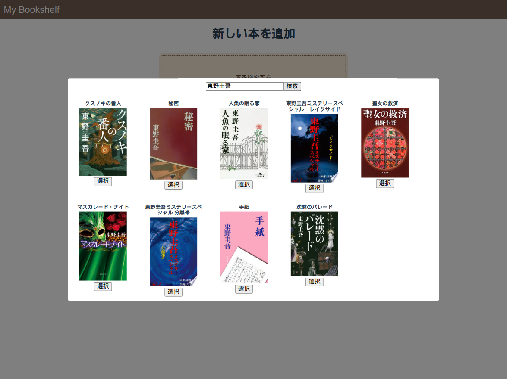
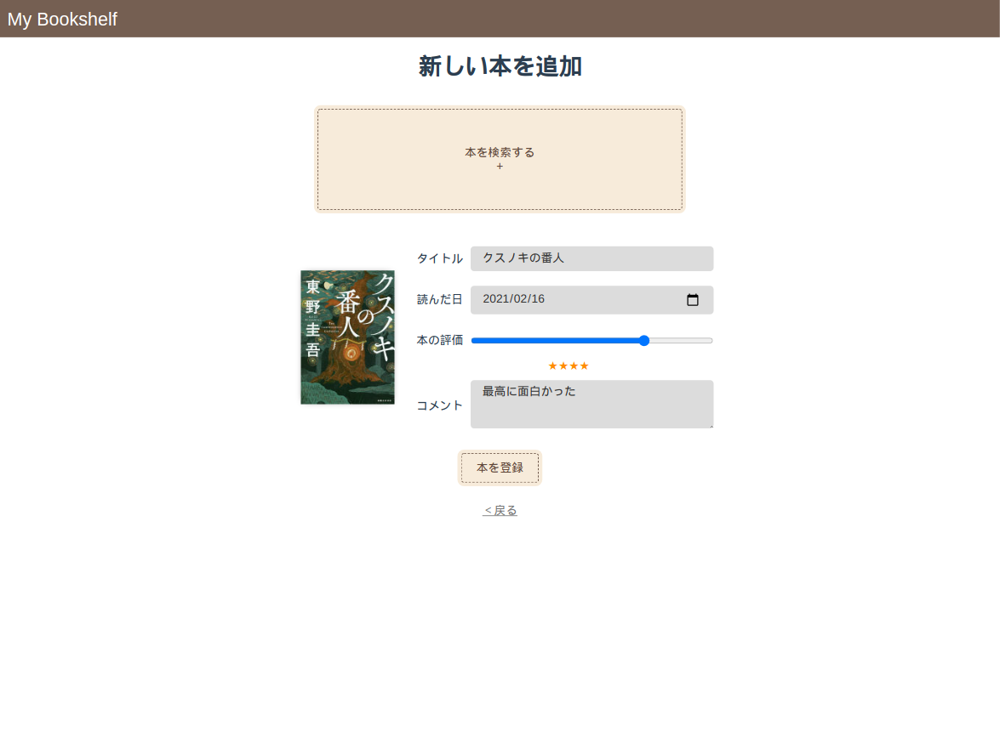

# my-bookshelf-front

## アプリ概要
読んだ本の感想などを保管できるアプリです。

■ 1st release  
　・ログイン機能  
　・読了日、評価、感想を添えられる  
■ 今後  
　・他の人の感想を読めるようにする  
　・ログを導入  
　・（その他考え中）  
## アーキテクチャ

## 使用技術
- Html
- Css
- Vue.js 3.0系
  - vue-router
  - axios
- Firebase
- Java
  - Spring Boot
  - Spring Data JPA
  - Lombok
- PostgreSQL

## ローカル環境構築
このリポジトリのほか、firebase、postgres、pgadmin、SpringBoot（my-bookshelf-back）が必要です。
今後、すべてDocker化したリポジトリを作成するので、そこに記します。

## アプリ画像
デプロイがまだできないので、こちらの画像でご紹介します。
  
  
  
  
##### 本を追加  
  
  
  
  
##### 詳細画面  
  